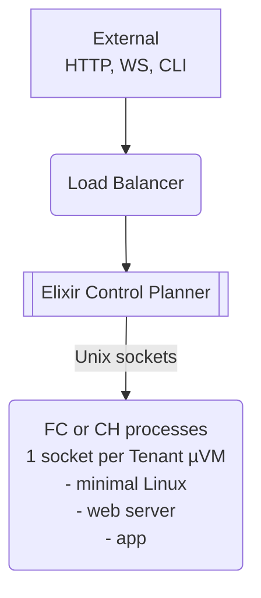
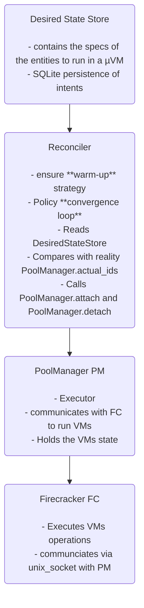

# Elixir based microVM Control Planner with Firecarcker or cLoud-hypervisor virtualization backend

DRAFT
[Building...]

POC of a Control Planner in Elixir for **microVMs** deployed with `firecracker` or `cloud-hypervisor`.
The Control Planner is itself a microVM. It allows you to run dynamically microVMs based on a declarative configuration.



Elixir makes a lot of sense for this project and really shines because of built-in concurrency and state management and supervision which makes the orchestration, control and coordination "easy".

The control planner is architectured with GenServers and based on Kubernetes architecture:

- the `DesiredStateStore` (persistent state),
- the executor `PoolManager` (runtime state),
- the control loop `Reconciler` (to ensure the runtime state matches the desired state),
- the VM supervisor `VMSup`: each VM is a dynamically supervised GenServer.

IT communicates with the backend (Firecracker or Cloud-Hypervisor) with a _Unix socket HTTP client_ (the _http.ex_ module).

The "warm pool" is also borowed from AWS lambda provisionned machines

**What is a warm VM**? It is a VM that is booted, running but not yet registered by the load balancer. Its role is to hide boot latency. A warm VM is a created and booted VM but not running. It is created per unique desired spec that is not a job everytime a VM of this type is running (within limits). The _specs/contract_ you pass that will defined what the VM will run.
This is useful only if the VM is a long running process, not for lambda jobs. This is controled with the `:lifecycle` field ("service" or "daemon" or "job") in the _specs_ (see below).
The "warm" VM is in particular useful when you we want to run a webapp with a local database (to the VM). During the VM setup, the webapp sets up its local database and imports the remote database. During the warm stage, it will receive all the changes in the database in the background (via a bridge-server in another microVM). The VM will be ready to start with an up-to-date local replica database.

**What are specs**? A VM is designed via its "rootfs" + "kernel args" + "environment/config injection". These elements are referenced in the specs that you will pass to `Firecracker` (FC).

An example of a config file:

```elixir
[

  %{  # VM type Phoenix webapp service
      "rootfs": "rootfs-web.ext4",
      "kernel": "vmlinux",
      "cmd": ["/app/bin/server"],
      "env": %{"MIX_ENV": "prod", "SECRET_KEY_BASE": "xyz..."},
      "resources": %{"vcpu": 2, "mem_mb": 512},
      "lifecycle": "service"
      warm_pool: %{min: 1,  max: 3 }
  },
  {...}
]
```

You have a mapping between the fields in the config and FC.
The warm_pool settings will be respected by the Reconciler process.

**How to run a VM?** A **mix task** is provided to run a VM based on a Docker image.

**Dynamic setup**: you have an endpoint to modify the desired state: add or remove VMs.

You can do:

```sh
curl -X POST http://localhost:8088/vms \
-H 'content-type:application/json' \
-d '{"job_id": "j3","tenant": "j3","spec": {"role": "web", "cmd": ["/app/bin/server"], "env": {"PORT": 4000, "SECRET_KEY_BASE": "xxx..."}}}'
```

> [!WARNING]
> On OSX, without an M3, you cannot run `Firecracker` (even with `lima`).

## Configuration

### Backend Selection

FcExCp supports both Firecracker (Linux x86_64) and Cloud Hypervisor (Linux/macOS, ARM64).

Configure the backend via environment variable:

```sh
# Use Firecracker (Linux x86_64 only)
FC_BACKEND=firecracker

# Use Cloud Hypervisor (cross-platform)
FC_BACKEND=cloud_hypervisor

# Then start
FC_BACKEND=xxx  iex -S mix
```

If not set, the backend is auto-detected:

- macOS → Cloud Hypervisor
- Linux → Firecracker

[](https://github.com/firecracker-microvm/firecracker)

[](https://github.com/cloud-hypervisor/cloud-hypervisor/blob/main/docs/api.md)


## Control Plan Manager (k8 like)



**How does this work**? On startup:

Application starts

- DesiredStateStore.init/1
- handle_continue(:put_desired_state)
- load_config_file()
- Read config/desired_vms.exs
- Insert into SQLite
- Reconciler picks up and starts VMs

- DesiredStateStore loads the desired_state
- Reconciler
  - reads the desired states and the current state.
  - detects missing job: Calls PoolManager.attach("web-app-1", spec)
- PoolManager checks warm pool:
  - Computes hash of spec
  - Looks for warm VM with matching hash
  - If found: assigns it to the job, schedules new warm VM
  - If not found: returns :no_warm_vm_available error
- Reconciler ensures warm VMs: For each unique spec in desired state, ensures one warm VM exists
