# Elixir based Firecracker Control Plan

[Working on...]

Build a Control Plan Manager in Elixir for Firecrackers microVMs.

Elixir makes lots of sense for this project.

```mermaid
flowchart TD
    A[External<br> HTTP, WS, CLI] --> LB(Load Balancer)
    LB -->E[[Elixir based Firecracker Control Plan Manager]]
    E  --> |Unix domain sockets <br>local only|F(Firecracker processes<br>1 socket per Tenant µVM<br>- minimal Linux<br>- web server<br>- app)
```



Produce 3 files:

- vmlinux (Linux kernel image)
- rootfs.ext4 (disk)
- vmconfig.json (Firecracker config via API)
  Host launches a VM:

```json
{
  "kernel_image_path": "vmlinux",
  "rootfs_path": "rootfs.ext4",
  "vcpu_count": 2,
  "mem_size_mib": 512
}
```

## MicroVM on OSX

```sh
brew install lima
```

Then autodetect and chose `ubuntu`:

```sh
limactl start --name=microvm --cpus=4 --memory=8 \
  --vm-type=qemu \
  template://ubuntu
```

Or manual setup with `aarch64` architecture (the command `uname -m` should return `arm64`):

```sh
cat > microvm.yaml << 'EOF'
# microvm-apple-silicon.yaml - For Apple Silicon Macs
images:
  - location: "https://cloud-images.ubuntu.com/jammy/current/jammy-server-cloudimg-arm64.img"
    arch: "aarch64"
arch: "aarch64"  # Crucial for Apple Silicon!
cpus: 4
memory: "8GiB"
disk: "50GiB"
mounts:
  - location: "~"
    writable: true
ssh:
  localPort: 60022
  forwardAgent: true
# Use vz for better performance on macOS Ventura+
# Use qemu for wider compatibility
vmType: "qemu"
provision:
  - mode: system
    script: |
      echo "=== Setting up Ubuntu ARM64 for microVMs ==="
      apt-get update
      apt-get install -y qemu-system-aarch64 qemu-utils \
        libvirt-daemon-system libvirt-clients git curl wget \
        build-essential pkg-config libssl-dev
      usermod -a -G kvm,libvirt $USER
      echo "=== ARM64 KVM setup complete ==="
  - mode: user
    script: |
      echo "=== Setting up ARM64 environment ==="
      mkdir -p ~/microvm-lab/{kernels,rootfs,scripts,configs}
      echo "=== Ready for ARM64 microVMs ==="
EOF
```

```sh
limactl start ./microvm.yaml
```

```sh
limactl list
NAME       STATUS     SSH                VMTYPE    ARCH       CPUS    MEMORY    DISK      DIR
microvm    Running    127.0.0.1:52506    qemu      aarch64    4       4GiB      100GiB    ~/.lima/microvm
```

To stop and delete:

```sh
limactl stop microvm
limactl delete microvm
```

To open the shell and install the virtualization tool: `qemu-kvm`

```sh
limactl shell microvm

sudo apt-get update && \
sudo apt-get install -y && \
    qemu-system-arm && \        # ARM system emulator
    qemu-system-aarch64 && \    # AArch64 specific
    qemu-utils && \             # Disk utilities
    qemu-system-data&&  \       # Firmware and data
    qemu-system-common       # Common files
```

Checks:

```sh
uname -m #<-- host
# aarch64
uname -a #<-- VM
Linux lima-microvm 6.17.0-6-generic #6-Ubuntu SMP PREEMPT_DYNAMIC Tue Oct  7 14:22:06 UTC 2025 aarch64 GNU/Linux
hostname
# lima-microvm
cat /etc/os-release
# PRETTY_NAME="Ubuntu 25.10" .....

which qemu-system-aarch64
#/usr/bin/qemu-system-aarch64
```

Install Firecracker:

```sh
mkdir -p ~/labs
cd ~/labs

FC_VERSION="v1.7.0"
curl -fsSL -o firecracker.tar.gz \
  "https://github.com/firecracker-microvm/firecracker/releases/download/${FC_VERSION}/firecracker-${FC_VERSION}-aarch64.tgz"

# Extract
tar -xzf firecracker.tar.gz
sudo cp release-${FC_VERSION}-aarch64/firecracker-${FC_VERSION}-aarch64 /usr/local/bin/firecracker
sudo chmod +x /usr/local/bin/firecracker

# Verify
firecracker --version
# Firecracker v1.7.0
```

```txt
sock = "/tmp/fc-#{vm_id}.sock"

Firecracker.HTTP.put(sock, "/machine-config", %{
  vcpu_count: 2,
  mem_size_mib: 512,
  smt: false
})

Firecracker.HTTP.put(sock, "/boot-source", %{
  kernel_image_path: kernel,
  boot_args: "console=ttyS0 reboot=k panic=1 pci=off init=/init"
})

Firecracker.HTTP.put(sock, "/drives/rootfs", %{
  drive_id: "rootfs",
  path_on_host: rootfs,
  is_root_device: true,
  is_read_only: false
})

Firecracker.HTTP.put(sock, "/network-interfaces/eth0", %{
  iface_id: "eth0",
  guest_mac: mac,
  host_dev_name: tap
})

Firecracker.HTTP.put(sock, "/actions", %{
  action_type: "InstanceStart"
})
```
