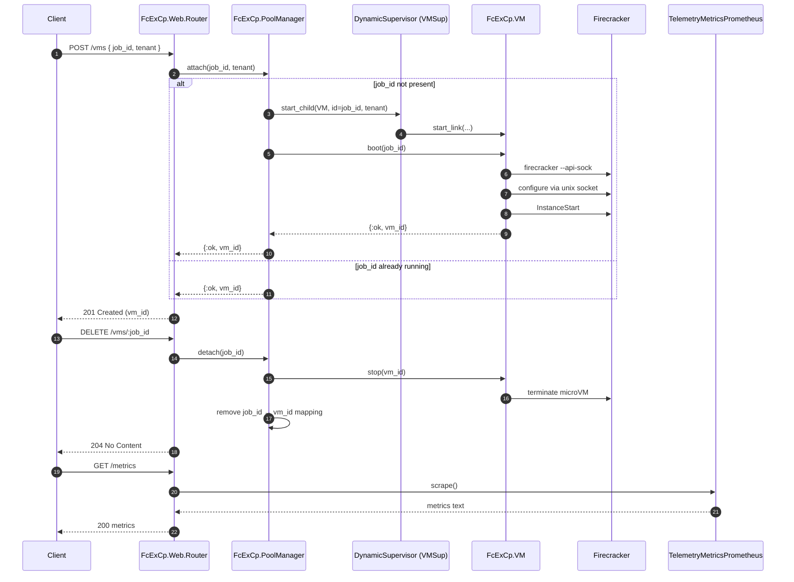
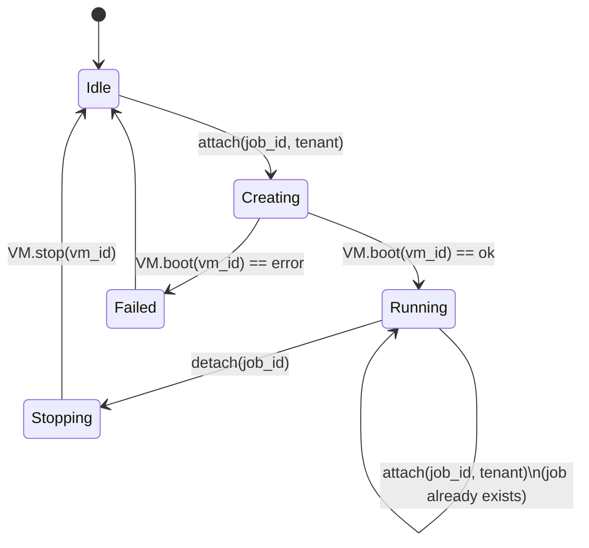
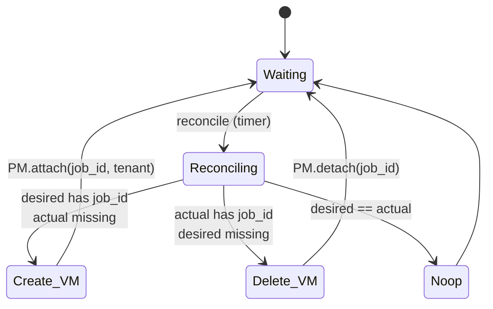
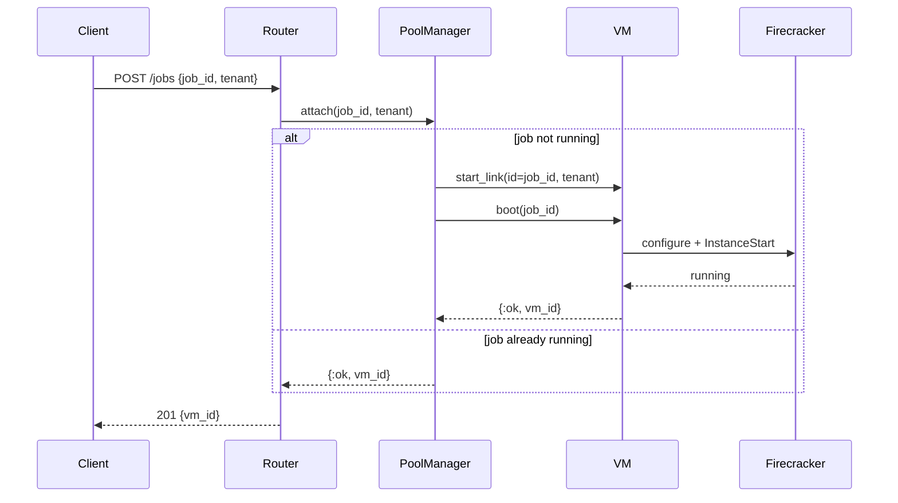
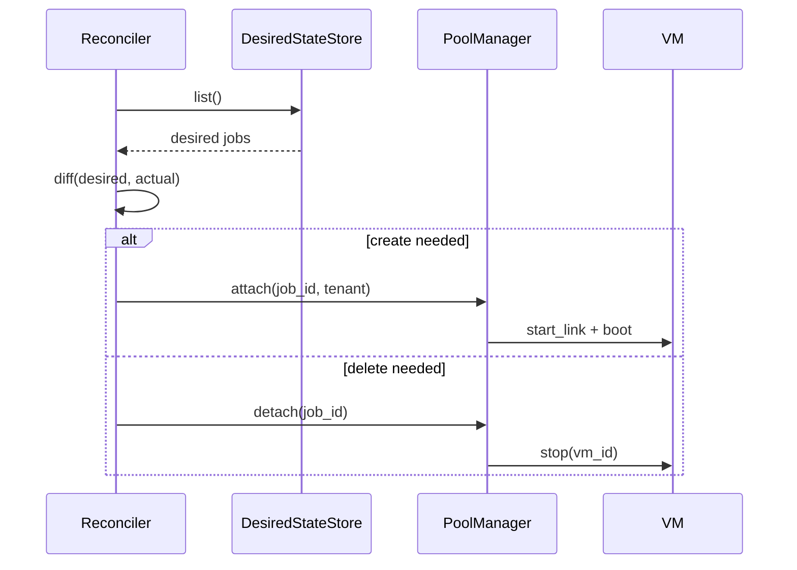
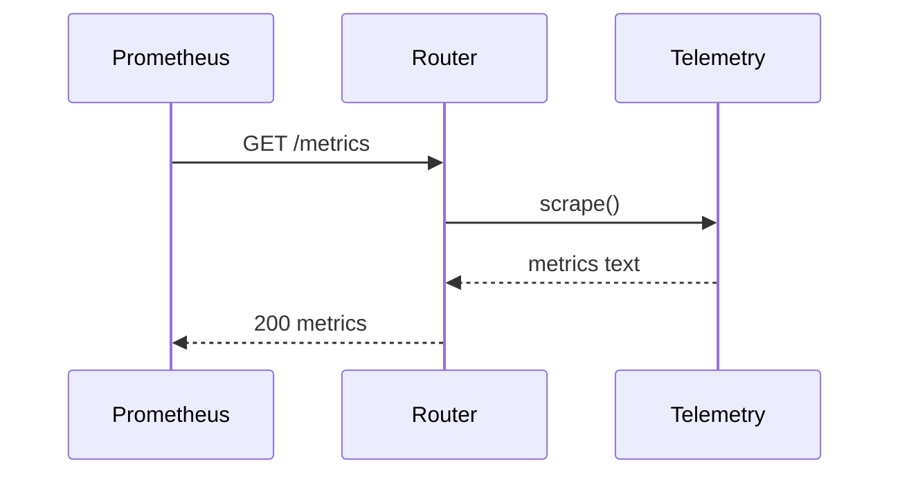
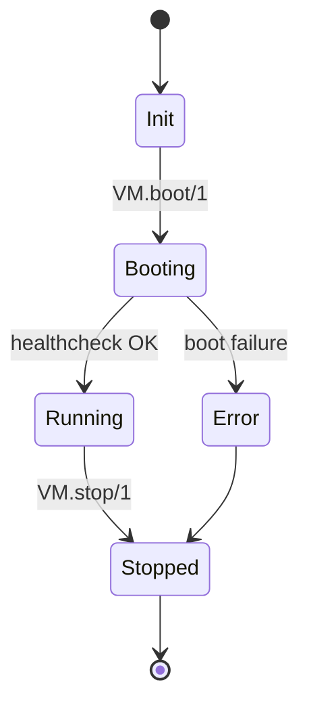

```mermaid
sequenceDiagram
    autonumber

    participant Client
    participant Router as FcExCp.Web.Router
    participant Pool as FcExCp.PoolManager
    participant Sup as DynamicSupervisor (VMSup)
    participant VM as FcExCp.VM
    participant FC as Firecracker

    %% ---- JOB ATTACH ----
    Client->>Router: POST /vms { job_id, tenant }
    Router->>Pool: attach(job_id, tenant)

    alt job_id not present
        Pool->>Sup: start_child(VM, id=job_id, tenant)
        Sup->>VM: start_link(...)
        Pool->>VM: boot(job_id)
        VM->>FC: firecracker --api-sock
        VM->>FC: configure via unix socket
        VM->>FC: InstanceStart
        VM-->>Pool: {:ok, vm_id}
        Pool-->>Router: {:ok, vm_id}
    else job_id already running
        Pool-->>Router: {:ok, vm_id}
    end

    Router-->>Client: 201 Created (vm_id)

    %% ---- JOB DETACH ----
    Client->>Router: DELETE /vms/:job_id
    Router->>Pool: detach(job_id)
    Pool->>VM: stop(vm_id)
    VM->>FC: terminate microVM
    Pool->>Pool: remove job_id → vm_id mapping
    Router-->>Client: 204 No Content

    %% ---- METRICS ----
    Client->>Router: GET /metrics
    Router->>TelemetryMetricsPrometheus: scrape()
    TelemetryMetricsPrometheus-->>Router: metrics text
    Router-->>Client: 200 metrics
```

```mermaid
stateDiagram-v2
    %% =========================
    %% PoolManager – job/VM state
    %% =========================

    [*] --> Idle

    Idle --> Creating : attach(job_id, tenant)
    Creating --> Running : VM.boot(vm_id) == ok
    Creating --> Failed : VM.boot(vm_id) == error

    Running --> Running : attach(job_id, tenant)\n(job already exists)
    Running --> Stopping : detach(job_id)

    Stopping --> Idle : VM.stop(vm_id)

    Failed --> Idle
```

```mermaid
stateDiagram-v2
    %% =========================
    %% Reconciler – desired/actual
    %% =========================

    [*] --> Waiting

    Waiting --> Reconciling : reconcile (timer)

    Reconciling --> Create_VM : desired has job_id<br>actual missing
    Reconciling --> Delete_VM : actual has job_id<br>desired missing
    Reconciling --> Noop : desired == actual

    Create_VM --> Waiting : PM.attach(job_id, tenant)
    Delete_VM --> Waiting : PM.detach(job_id)
    Noop --> Waiting

```

```mermaid
sequenceDiagram
    %% =========================
    %% HTTP → PoolManager flow
    %% =========================

    participant Client
    participant Router
    participant PoolManager
    participant VM
    participant Firecracker

    Client->>Router: POST /jobs {job_id, tenant}
    Router->>PoolManager: attach(job_id, tenant)

    alt job not running
        PoolManager->>VM: start_link(id=job_id, tenant)
        PoolManager->>VM: boot(job_id)
        VM->>Firecracker: configure + InstanceStart
        Firecracker-->>VM: running
        VM-->>PoolManager: {:ok, vm_id}
    else job already running
        PoolManager-->>Router: {:ok, vm_id}
    end

    Router-->>Client: 201 {vm_id}
```

```mermaid
sequenceDiagram
    %% =========================
    %% Reconciler-driven flow
    %% =========================

    participant Reconciler
    participant DesiredStateStore
    participant PoolManager
    participant VM

    Reconciler->>DesiredStateStore: list()
    DesiredStateStore-->>Reconciler: desired jobs

    Reconciler->>Reconciler: diff(desired, actual)

    alt create needed
        Reconciler->>PoolManager: attach(job_id, tenant)
        PoolManager->>VM: start_link + boot
    else delete needed
        Reconciler->>PoolManager: detach(job_id)
        PoolManager->>VM: stop(vm_id)
    end
```

```mermaid
sequenceDiagram
    %% =========================
    %% Metrics exposure
    %% =========================

    participant Prometheus
    participant Router
    participant Telemetry

    Prometheus->>Router: GET /metrics
    Router->>Telemetry: scrape()
    Telemetry-->>Router: metrics text
    Router-->>Prometheus: 200 metrics
```

```mermaid
stateDiagram-v2
    %% =========================
    %% VM lifecycle (VM.ex)
    %% =========================

    [*] --> Init
    Init --> Booting : VM.boot/1
    Booting --> Running : healthcheck OK
    Booting --> Error : boot failure
    Running --> Stopped : VM.stop/1
    Error --> Stopped
    Stopped --> [*]
```
